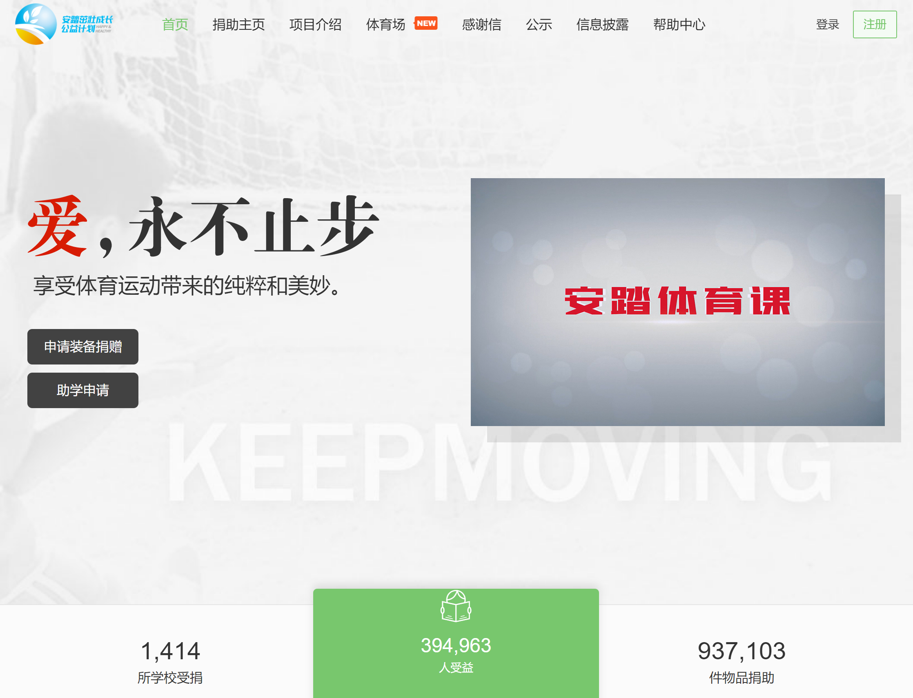
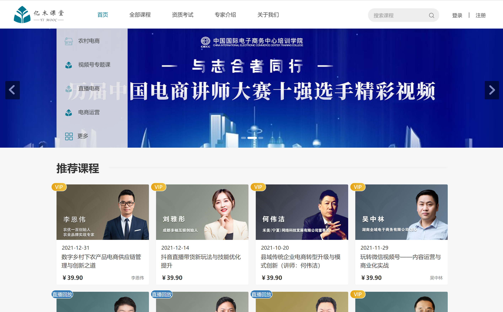

# 案例

## 格桑花西部助学网

[www.gesanghua.org](http://www.gesanghua.org/)
* 负责网站架构设计
* 主要逻辑代码的编写
* 使用rails5+postgres开发

---

## 青基会茁壮成长

[zzcz.wikiflyer.cn](http://zzcz.wikiflyer.cn/)
* 负责网站架构设计
* 主要逻辑代码的编写
* 使用rails5+postgres开发

---

## 亿木课堂

[www.ymooc.com.cn](http://www.ymooc.com.cn/)
* 类慕课网项目
* 负责网站架构设计
* 主要逻辑代码的编写
* 使用rails5+postgres开发
* 视频点播对接腾讯云

---

## 潍坊商务局二维码追溯系统

---

## 海尔创客实验室
[lab.haier.com](http://lab.haier.com/)
* 负责网站架构设计
* 主要逻辑代码的编写
* 使用Laravel5+MySQL开发