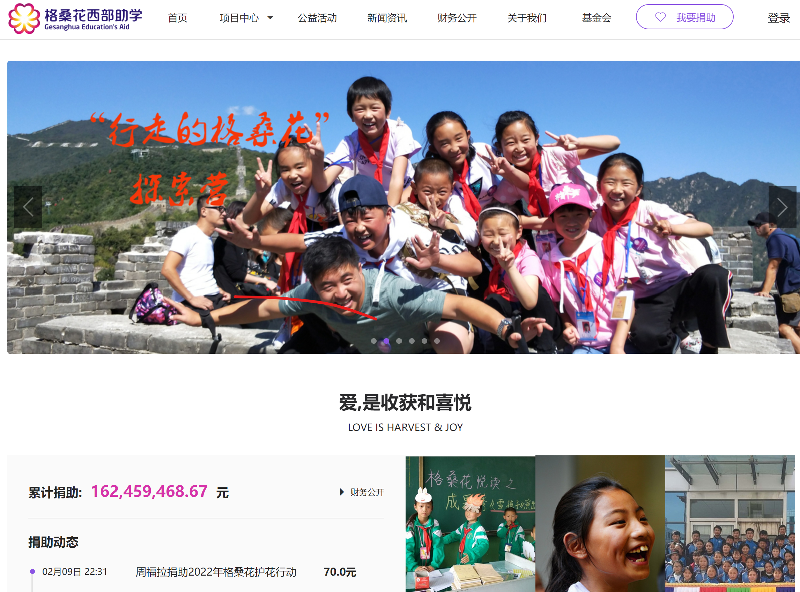
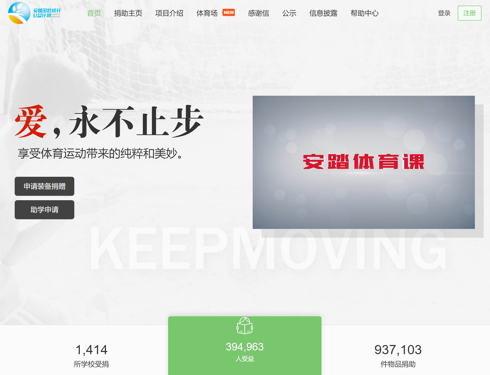

# 案例

## 格桑花西部助学网

[格桑花西部助学网](http://www.gesanghua.org/)
* 负责网站架构设计
* 主要逻辑代码的编写
* 使用rails5+postgres开发

---

## 青基会茁壮成长

* 负责网站架构设计
* 主要逻辑代码的编写
* 使用rails5+postgres开发

---

## 亿木课堂

* 类慕课网项目
* 负责网站架构设计
* 主要逻辑代码的编写
* 使用rails5+postgres开发
* 视频点播对接腾讯云

---

## 潍坊商务局二维码追溯系统

---

## 海尔创客实验室

* 负责网站架构设计
* 主要逻辑代码的编写
* 使用Laravel5+MySQL开发

---

## Rails
* [格桑花西部助学网](http://www.gesanghua.org/) 国内老牌的资助西部贫困学生的项目
* [青基会茁壮成长](http://zzcz.wikiflyer.cn/) 安踏体育用品资助的公益项目
* [亿木课堂](http://www.ymooc.com.cn/) 在线视频学习网站
* 幼儿园网站管理系统 专为幼儿园等教育机构开发的快速建站和管理工具
* 潍坊商务局二维码追溯系统 潍坊商务局二维码追溯系统是给潍坊商务局打造的追溯食品、农产品的商品溯源系统
* 党建平台 集团公司内部的党建平台

## PHP
* [海尔创客实验室](https://lab.haier.com/) 海尔集团为服务创客群体打造的社区平台
* 客推推网站和APP 网上看房和租房的平台，包括PC端网站和手机APP

## ASP
* [eJob](https://github.com/songjian/ejob)

* 熟悉CI/CD
* 熟悉项目管理流程
* 熟悉敏捷开发——Scrum
* 熟悉docker构建、发布和部署
* 使用ssh端口转发，打通内网网站的公网访问
* git仓库
* 通过使用JWT，实现了管理后台的登录验证，将开发周期缩短了3周
* 与前端工程师团队合作，一起开发、部署、故障排查了7个Web应用程序
* 与Golang语言同事合作，使用3天时间，将接口……